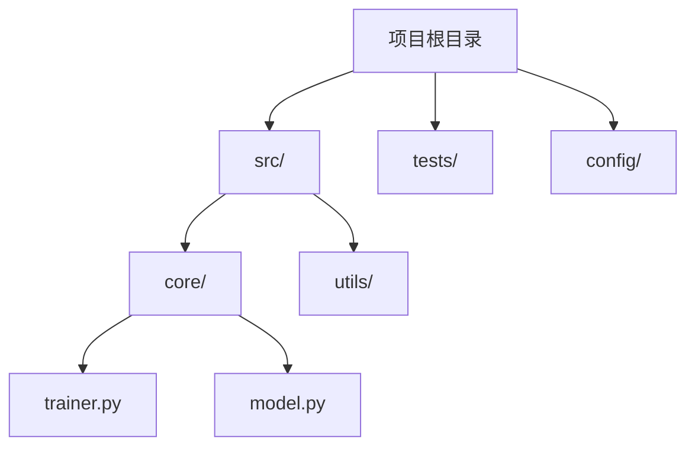
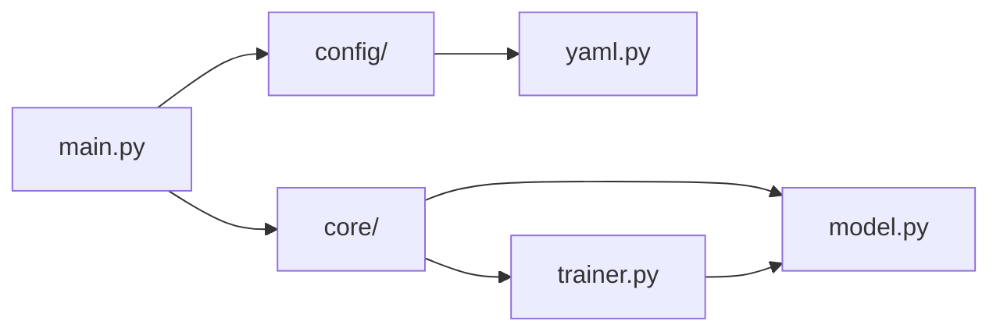
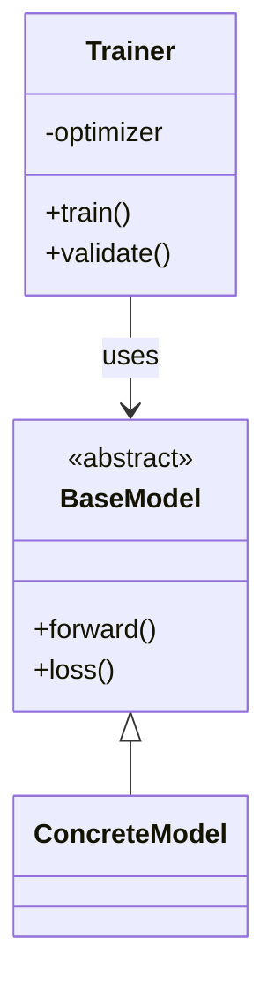
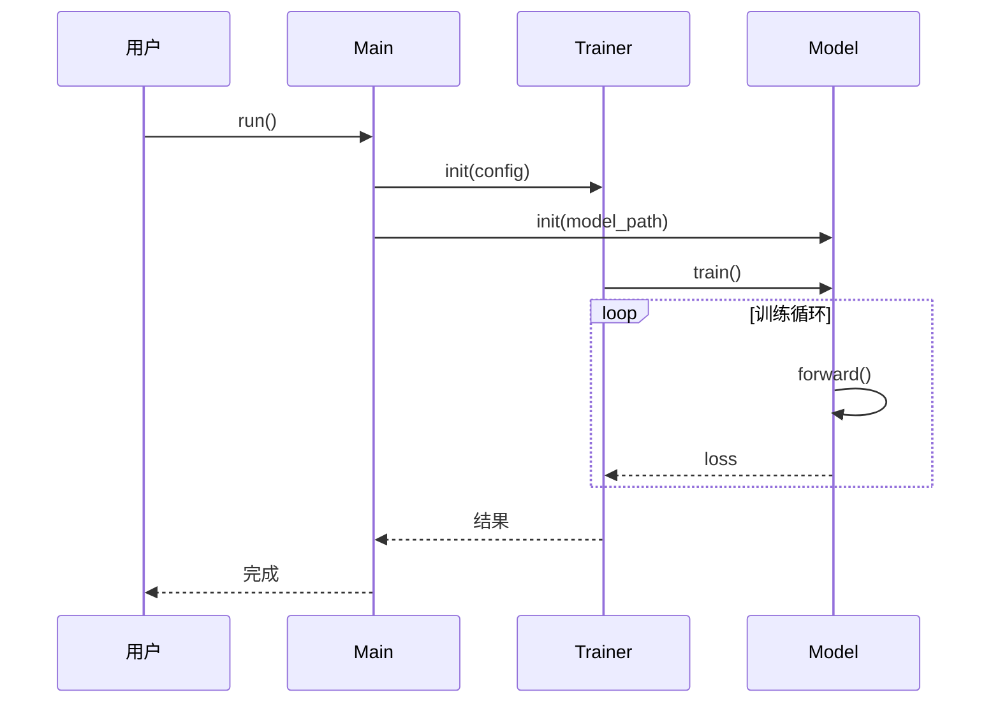

# Code Doc Generator

为 Python 项目生成详细的技术文档，帮助用户理解如何使用、修改和拓展代码库。

## 使用场景

用户请求示例：
- "帮我写一个文档介绍这个项目的训练流程"
- "分析一下模型初始化时每个时间点做了什么"
- "生成一份数据流文档，说明数据从输入到输出的完整过程"
- "这个模块是怎么工作的？用时间线的方式说明"
- "我想了解推理过程中各个组件是如何配合的"

## 核心能力

1. **自顶向下的项目分析** - 从目录结构到核心模块，层层深入
2. **时间线驱动的流程追踪** - 按执行顺序组织，明确每个时间点的操作
3. **详细的输入输出规格** - 每个阶段都有清晰的输入数据、输出数据和处理逻辑
4. **代码示例驱动** - 用具体代码片段说明关键逻辑
5. **架构图生成** - 使用 Mermaid 绘制模块图、类图、时序图
6. **用户偏好记忆** - 自动保存和加载用户的文档偏好设置

## 工作流程

### Step 1: 理解用户意图

解析用户请求，提取关键信息：
- **关注点**：初始化、数据流、模块协作、某个具体功能等
- **深度要求**：是否需要深入到函数/类级别（默认需要）
- **示例需求**：是否需要具体的使用示例

### Step 2: 探索代码结构

1. 获取项目目录结构
2. 识别核心文件（`__init__.py`, `main.py`, `config.py` 等）
3. 分析模块依赖关系
4. 定位关键类和函数

### Step 3: 追踪执行流程

1. 从入口点开始追踪
2. 按时间顺序记录每个初始化步骤
3. 追踪数据在各模块间的流动
4. 记录每个函数的输入输出规格

### Step 4: 生成文档

使用模板生成结构化文档，包含：
- 项目概述
- 目录结构
- 核心模块架构
- 架构图（Mermaid）
- 时间线驱动的执行流程
- 关键组件详解
- 使用指南
- 修改与拓展指南

### Step 4.5: 生成架构图

**必须生成以下架构图类型**：

#### 4.5.1 项目目录结构图

使用 Mermaid `graph TD` 展示项目整体结构：



#### 4.5.2 模块依赖图

使用 Mermaid `graph LR` 展示模块间依赖关系：



#### 4.5.3 执行流程图

使用 Mermaid `flowchart TB` 展示核心执行流程：

```mermaid
flowchart TB
    start([程序启动]) --> T1[T=1: 加载配置]
    T1 --> T2[T=2: 初始化模型]
    T2 --> T3[T=3: 加载数据]
    T3 --> T4[T=4: 训练循环]
    T4 --> T5[T=5: 评估]
    T5 --> end([结束])
```

#### 4.5.4 数据流图

使用 Mermaid `flowchart LR` 展示数据在各模块间的流动：


#### 4.5.5 类图 (关键类)

使用 Mermaid `classDiagram` 展示核心类及其关系：



#### 4.5.6 时序图 (关键交互)

使用 Mermaid `sequenceDiagram` 展示关键交互：



**架构图生成原则**：
1. 每个项目至少包含 **项目目录结构图** 和 **执行流程图**
2. 复杂项目增加 **模块依赖图** 和 **数据流图**
3. 涉及多个类协作的项目增加 **类图** 和 **时序图**
4. 架构图必须与文档文字内容对应
5. 使用清晰的节点标签，避免过长文字

## 用户偏好管理

### 加载偏好

在开始分析前，读取 `references/user_preferences.json`：
- 文档深度级别
- 是否包含目录树
- 是否显示时间戳
- 语言偏好等

### 保存偏好

当用户提出新的偏好（如更详细的文档、不同的格式），更新偏好文件：

```python
# 自动保存用户偏好
def save_preferences(updates):
    """更新并保存用户偏好"""
    pref = load_preferences()
    pref.update(updates)
    save_preferences(pref)
```

## 文档模板

生成文档时使用 `references/doc_template.md` 作为模板，确保：
- 一致的结构
- 完整的字段覆盖
- 清晰的时间线标记

## 代码分析模式

遵循 `references/analysis_patterns.md` 中的标准方法：
- 目录结构探索
- 模块依赖分析
- 执行流程追踪
- 类/函数详细分析

## 关键约定

### 时间点标记

使用 T=X 标记时间点：
- T=0: 程序启动/模块导入
- T=1~: 初始化阶段（毫秒/逻辑顺序）
- T=10+: 核心处理阶段

### 输入输出表格

每个处理阶段必须包含：

| 参数/输入 | 类型 | 来源 | 说明 |
|----------|------|------|------|
| data | Dict | 上游模块 | 处理后的数据 |

### 代码块标注

所有代码块必须标注来源：

```python
# 文件路径: src/core/trainer.py:45
# 函数: Trainer.__init__
```

## 保存文档

生成文档后，**必须**询问用户：

```
文档已生成完毕！

请提供保存路径和文件名，例如：
- ./docs/{项目名}_guide.md
- /path/to/documentation.md
- 直接按 Enter 保存到默认位置
```

## 输出要求

- 文档语言：中文（用户请求为中文时）
- 深度：函数/类级别
- 格式：Markdown
- 内容：
  - 必须包含时间线、输入输出、代码示例
  - 必须包含架构图（Mermaid），至少包含：
    - 项目目录结构图
    - 执行流程图
- 架构图：使用 Mermaid 语法，类型包括 graph TD, graph LR, flowchart, classDiagram, sequenceDiagram

## Resources

### references/

- `doc_template.md` - 文档生成模板
- `analysis_patterns.md` - 代码分析模式指南
- `user_preferences.json` - 用户偏好存储

### scripts/

包含辅助分析脚本（如有需要）

### assets/

文档中使用的资源文件（如有需要）
