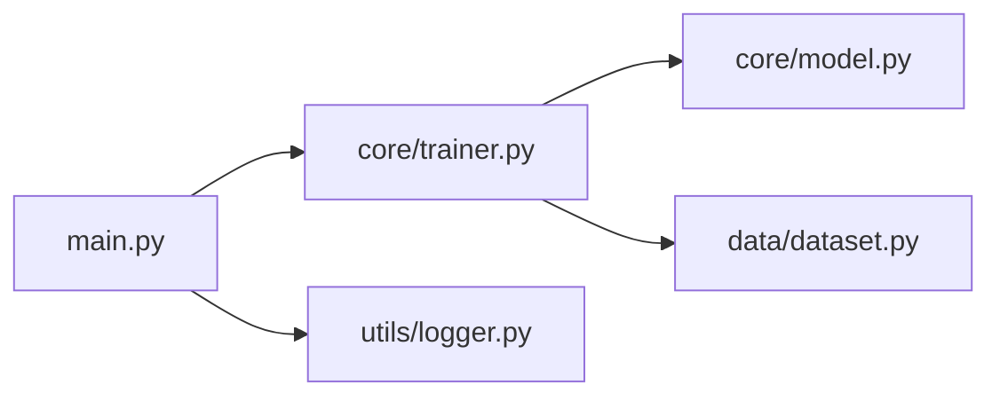

# 代码分析模式指南

本文档提供分析 Python 项目代码的标准方法论，确保生成的文档具有一致性和完整性。

## 分析流程

```
┌─────────────┐     ┌─────────────┐     ┌─────────────┐     ┌─────────────┐
│  1. 探索结构  │ --> │  2. 理解依赖  │ --> │  3. 追踪流程  │ --> │  4. 文档生成  │
└─────────────┘     └─────────────┘     └─────────────┘     └─────────────┘
```

---

## 1. 探索目录结构

### 第一步：获取概览

```bash
# 列出项目根目录结构
find . -type f -name "*.py" | head -50
find . -type d -name "*" -maxdepth 3 | grep -v __pycache__ | grep -v ".git"
```

### 第二步：识别核心文件

关注以下文件类型：

| 文件类型 | 用途 | 分析重点 |
|----------|------|----------|
| `__init__.py` | 模块初始化 | 导出内容、初始化逻辑 |
| `main.py` / `app.py` | 入口点 | 程序启动流程 |
| `config.py` | 配置管理 | 配置项和默认值 |
| `setup.py` / `pyproject.toml` | 项目配置 | 依赖、入口点 |
| `requirements.txt` | 依赖列表 | 外部库依赖 |

### 第三步：建立目录映射

为每个主要目录创建描述：

```markdown
| 目录 | 职责 | 关键文件 |
|------|------|----------|
| `src/` | 源代码 | `main.py`, `core/` |
| `tests/` | 测试用例 | `test_*.py` |
| `configs/` | 配置文件 | `*.yaml`, `*.json` |
```

---

## 2. 理解模块依赖

### 导入分析

逐文件分析 `import` 语句：

```python
# 标准库导入
import os
import sys
from datetime import datetime

# 第三方库导入
import numpy as np
from torch import nn

# 本地导入
from .module_a import ClassA
from ..utils import helper_func
```

### 依赖关系记录

| 模块 | 被导入自 | 导入内容 | 依赖类型 |
|------|----------|----------|----------|
| `core/trainer.py` | `main.py` | `Trainer` 类 | 强依赖 |
| `utils/logger.py` | `core/trainer.py` | `Logger` | 可选依赖 |

### 依赖图构建



---

## 3. 追踪执行流程

### 时间线分析方法

对于每个关键流程，按以下步骤分析：

#### 步骤 1：找到入口点

```python
# main.py
if __name__ == "__main__":
    app = Application(config)
    app.run()
```

#### 步骤 2：追踪初始化链

| 时间点 | 组件 | 初始化内容 | 文件位置 |
|--------|------|------------|----------|
| T=0 | `Application` | 加载配置、初始化组件 | `app.py:__init__` |
| T=10 | `Trainer` | 加载模型、优化器 | `trainer.py:__init__` |
| T=20 | `DataLoader` | 加载数据集 | `dataloader.py:__init__` |

#### 步骤 3：追踪数据流

```python
def dataflow_trace():
    """
    数据流追踪模板

    输入 -> [处理] -> 输出
    """
    # 1. 输入阶段
    raw_data = load_data(config.path)

    # 2. 预处理阶段
    processed = preprocess(raw_data)

    # 3. 模型推理
    output = model.predict(processed)

    # 4. 后处理
    result = postprocess(output)

    return result
```

### 函数调用链分析

对于关键函数，追踪其完整调用链：

```python
# 调用链追踪模板
"""
main()
  └─> app.run()
        └─> trainer.train()
              ├─> dataloader.get_batch()
              │     └─> dataset.__getitem__()
              ├─> model.forward()
              │     └─> layer1.forward()
              │           └─> layer2.forward()
              └─> loss.compute()
                    └─> criterion(output, target)
```

### 输入输出追踪

对于每个处理阶段，记录：

| 阶段 | 输入 | 处理逻辑 | 输出 | 数据类型 |
|------|------|----------|------|----------|
| 数据加载 | 文件路径 | `load()` | Dataset对象 | 自定义类 |
| 数据预处理 | Dataset对象 | `transform()` | Tensor | `torch.Tensor` |
| 模型推理 | Tensor | `forward()` | Tensor | `torch.Tensor` |

---

## 4. 类与函数分析

### 类分析模板

```python
class ClassName:
    """
    {简要描述类的职责}

    职责：
    1. {主要职责1}
    2. {主要职责2}
    """

    def __init__(self, config):
        """
        初始化方法

        Args:
            config: 配置对象/字典
        """
        self.config = config
        self.state = {}  # 状态变量

    def method_name(self, param):
        """
        方法说明

        Args:
            param: 参数说明

        Returns:
            返回值说明
        """
        pass
```

### 函数分析模板

```python
def function_name(arg1, arg2, **kwargs):
    """
    函数说明

    Args:
        arg1: 参数1说明
        arg2: 参数2说明
        kwargs: 关键字参数

    Returns:
        返回值说明

    Raises:
        Exception: 异常条件
    """
    # 函数逻辑
    pass
```

### 装饰器分析

如果函数有装饰器，需要说明其作用：

```python
@torch.no_grad()  # 推理时禁用梯度计算，节省内存
def evaluate(model, dataloader):
    """评估模型"""
    pass

@timer  # 记录函数执行时间
def train_epoch(model, data):
    """训练一个 epoch"""
    pass
```

---

## 5. 文档生成规范

### 文档结构优先级

1. **项目概述** - 1-2 段话说明项目是什么
2. **目录结构** - 树形结构 + 简要说明
3. **核心模块** - 按依赖顺序组织
4. **执行流程** - 按时间线组织，包含具体时间点
5. **使用指南** - 快速开始代码
6. **修改拓展** - 如何扩展功能

### 时间点标记规范

| 标记 | 含义 | 示例 |
|------|------|------|
| T=0 | 程序启动/初始化开始 | `Application()` 构造函数入口 |
| T=1ms | 毫秒级时间点 | 配置加载完成 |
| T=100ms | | 数据集加载完成 |
| T=1s | 秒级时间点 | 首个训练 batch 处理 |

> **注意**：实际时间取决于具体实现，这里使用相对时间或逻辑时间点

### 代码示例规范

```python
# 文件路径: src/core/trainer.py
# 行号: 45-52
# 上下文: Trainer 类的初始化方法

def __init__(self, config: TrainConfig):
    """
    初始化训练器

    T=10: 创建模型
    T=20: 加载预训练权重（如果指定）
    T=30: 初始化优化器
    """
    self.config = config
    self.model = self._create_model()        # T=10
    self.optimizer = self._create_optimizer()  # T=30
```

### 避免的内容

- 不要包含临时文件或缓存目录
- 不要包含 `.gitignore` 文件的说明
- 不要包含过于琐碎的实现细节
- 不要包含自动生成的代码

### 必须包含的内容

- 所有自定义模块的职责说明
- 关键函数的输入输出规格
- 配置项的说明和默认值
- 使用示例代码
- 拓展和修改指南

---

## 6. 用户意图解析

### 常见用户请求模式

| 用户请求 | 解析为 | 文档重点 |
|----------|--------|----------|
| "模型训练如何初始化" | 初始化流程分析 | `__init__` 方法序列 |
| "数据是如何流动的" | 数据流分析 | 各阶段的输入输出 |
| "推理流程是什么" | 推理流程分析 | `predict/inference` 方法链 |
| "配置文件如何工作" | 配置系统分析 | 配置加载和注入 |
| "模块间如何通信" | 模块依赖分析 | 接口和消息传递 |

### 关键词映射

| 关键词 | 文档模块 |
|--------|----------|
| 初始化、创建、setup | 数据流与执行流程 - 阶段1 |
| 数据、流、传递 | 数据流与执行流程 |
| 使用、运行、启动 | 使用指南 |
| 修改、扩展、添加 | 修改与拓展 |
| 调用、依赖、导入 | 核心模块架构 |

---

## 7. 文件保存规范

### 保存前询问

在生成文档后，必须询问用户：

```
文档已生成完毕！

请提供保存路径和文件名，例如：
- ./docs/project_documentation.md
- /Users/name/Documents/code_docs.md
- project_guide.md（保存到当前目录）

或者直接按 Enter 保存到默认位置：./{项目名}_docs.md
```

### 保存格式

- 始终使用 `.md` 扩展名
- 编码：UTF-8
- 行尾：LF（Unix 风格）
