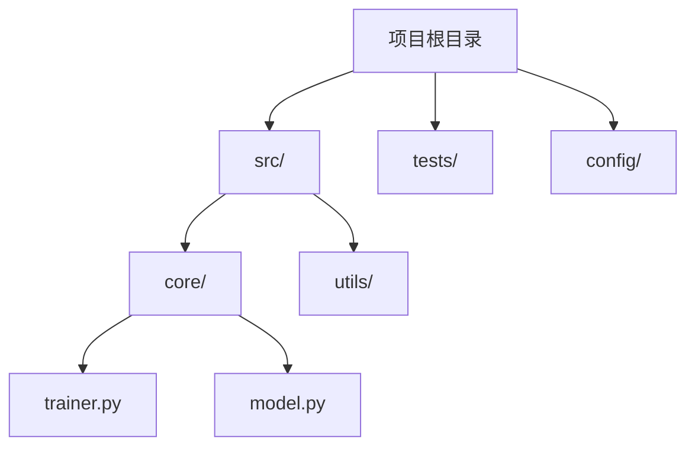
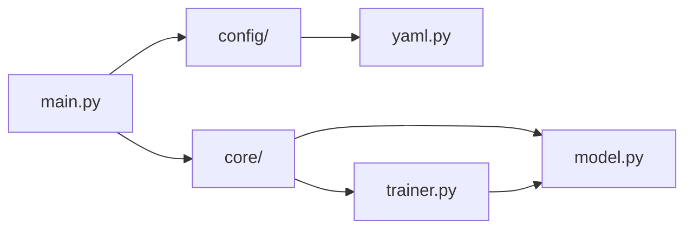
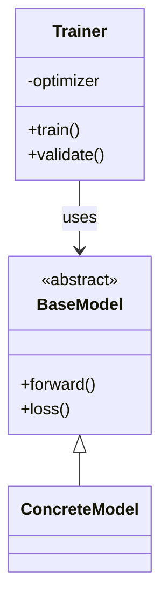
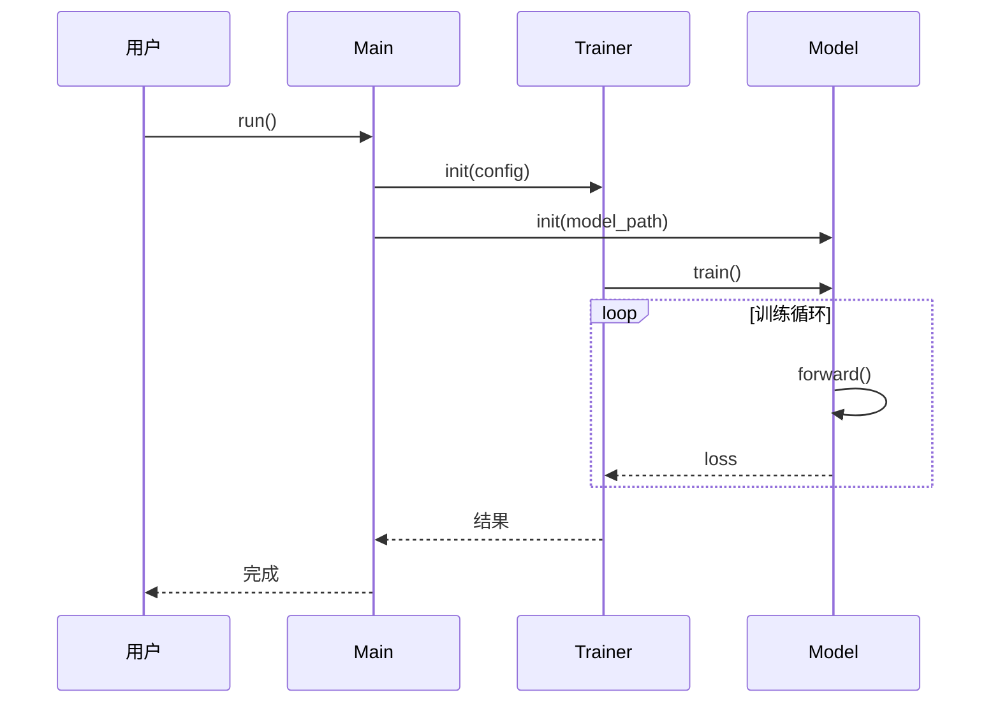

# Code Doc Generator

为 Python 项目生成详细的技术文档，帮助用户理解如何使用、修改和拓展代码库。

## 使用场景

用户请求示例：
- "帮我写一个文档介绍这个项目的训练流程"
- "分析一下模型初始化时每个时间点做了什么"
- "生成一份数据流文档，说明数据从输入到输出的完整过程"
- "这个模块是怎么工作的？用时间线的方式说明"
- "我想了解推理过程中各个组件是如何配合的"

## 核心能力

1. **自顶向下的项目分析** - 从目录结构到核心模块，层层深入
2. **时间线驱动的流程追踪** - 按执行顺序组织，明确每个时间点的操作
3. **详细的输入输出规格** - 每个阶段都有清晰的输入数据、输出数据和处理逻辑
4. **代码示例驱动** - 用具体代码片段说明关键逻辑
5. **架构图生成** - 使用 Mermaid 绘制模块图、类图、时序图
6. **用户偏好记忆** - 自动保存和加载用户的文档偏好设置

## 工作流程

### Step 1: 理解用户意图

解析用户请求，提取关键信息：
- **关注点**：初始化、数据流、模块协作、某个具体功能等
- **深度要求**：是否需要深入到函数/类级别（默认需要）
- **示例需求**：是否需要具体的使用示例

### Step 2: 探索代码结构

1. 获取项目目录结构
2. 识别核心文件（`__init__.py`, `main.py`, `config.py` 等）
3. 分析模块依赖关系
4. 定位关键类和函数

### Step 3: 追踪执行流程

1. 从入口点开始追踪
2. 按时间顺序记录每个初始化步骤
3. 追踪数据在各模块间的流动
4. 记录每个函数的输入输出规格
5. **应用第一性原理分析每个步骤的设计原因**

### Step 4: 生成文档

使用模板生成结构化文档，包含：
- 项目概述
- 目录结构
- 核心模块架构
- 架构图（Mermaid）
- 时间线驱动的执行流程
- **第一性原理分析（每个关键组件的设计原因和效果）**
- 关键组件详解（含输入输出规格）
- 使用指南
- 修改与拓展指南

### Step 4.5: 生成架构图

**必须生成以下架构图类型**：

#### 4.5.1 项目目录结构图

使用 Mermaid `graph TD` 展示项目整体结构：



#### 4.5.2 模块依赖图

使用 Mermaid `graph LR` 展示模块间依赖关系：



#### 4.5.3 执行流程图

使用 Mermaid `flowchart TB` 展示核心执行流程：

```mermaid
flowchart TB
    start([程序启动]) --> T1[T=1: 加载配置]
    T1 --> T2[T=2: 初始化模型]
    T2 --> T3[T=3: 加载数据]
    T3 --> T4[T=4: 训练循环]
    T4 --> T5[T=5: 评估]
    T5 --> end([结束])
```

#### 4.5.4 数据流图

使用 Mermaid `flowchart LR` 展示数据在各模块间的流动：


#### 4.5.5 类图 (关键类)

使用 Mermaid `classDiagram` 展示核心类及其关系：



#### 4.5.6 时序图 (关键交互)

使用 Mermaid `sequenceDiagram` 展示关键交互：



**架构图生成原则**：
1. 每个项目至少包含 **项目目录结构图** 和 **执行流程图**
2. 复杂项目增加 **模块依赖图** 和 **数据流图**
3. 涉及多个类协作的项目增加 **类图** 和 **时序图**
4. 架构图必须与文档文字内容对应
5. 使用清晰的节点标签，避免过长文字

## 用户偏好管理

### 加载偏好

在开始分析前，读取 `references/user_preferences.json`：
- 文档深度级别
- 是否包含目录树
- 是否显示时间戳
- 语言偏好等

### 保存偏好

当用户提出新的偏好（如更详细的文档、不同的格式），更新偏好文件：

```python
# 自动保存用户偏好
def save_preferences(updates):
    """更新并保存用户偏好"""
    pref = load_preferences()
    pref.update(updates)
    save_preferences(pref)
```

## 文档模板

生成文档时使用 `references/doc_template.md` 作为模板，确保：
- 一致的结构
- 完整的字段覆盖
- 清晰的时间线标记

## 代码分析模式

遵循 `references/analysis_patterns.md` 中的标准方法：
- 目录结构探索
- 模块依赖分析
- 执行流程追踪
- 类/函数详细分析

## 关键约定

### 时间点标记

使用 T=X 标记时间点：
- T=0: 程序启动/模块导入
- T=1~: 初始化阶段（毫秒/逻辑顺序）
- T=10+: 核心处理阶段

### 输入输出表格

每个处理阶段必须包含：

| 参数/输入 | 类型 | 来源 | 说明 |
|----------|------|------|------|
| data | Dict | 上游模块 | 处理后的数据 |

### 代码块标注

所有代码块必须标注来源：

```python
# 文件路径: src/core/trainer.py:45
# 函数: Trainer.__init__
```

## 保存文档

生成文档后，**必须**询问用户：

```
文档已生成完毕！

请提供保存路径和文件名，例如：
- ./docs/{项目名}_guide.md
- /path/to/documentation.md
- 直接按 Enter 保存到默认位置
```

## 第一性原理分析框架

在生成技术文档时，**必须**使用第一性原理思维帮助用户深入理解代码设计的本质。这不仅解释"代码做了什么"，更重要的是解释"为什么要这样设计"和"这样设计的效果是什么"。

### 什么是第一性原理思维

> 第一性原理思维是指将问题分解为其**基本组成部分**，然后**系统地从头构建解决方案**的思维方式。

与基于类比或经验的思维方式不同，它要求：
- 关注问题的**根本原因**（root causes）
- 避免被**无关细节**或**二手信息**分散注意力
- 基于**自明的真理或公理**进行逻辑推理

### 四步分析法

在分析代码时，按以下步骤进行：

| 步骤 | 方法 | 关键问题 |
|:---|:---|:---|
| **Step 1: 分解** | 识别核心功能并分解为基本要素 | "这个功能最本质要解决什么问题？" |
| **Step 2: 追问** | 连续追问"为什么" | "为什么要这样设计？为什么要用这个数据结构？" |
| **Step 3: 质疑** | 检验假设和约束 | "如果不这样做会怎样？有没有更本质的解决方案？" |
| **Step 4: 重构** | 从零构建解释 | "如果重新设计，最精简的方案是什么？" |

### 软件设计的第一性原理：结构化抽象

软件设计的本质是**结构化抽象**：

> "软件本质上是一种可动态而弹性变化的逻辑装置。"

所有软件逻辑建始于两条基本公理：
1. **数学公理**：1 + 1 = 2
2. **机器约束**：字长有限、内存有限、执行指令需要 CPU 时钟周期

几乎所有软件问题都是这两个基本要素的组合和叠加而产生的。

### 技术机制的第一性原理解释

在文档中解释技术机制时，使用以下结构化抽象定义：

| 技术机制 | 第一性原理定义 | 设计效果 |
|:---|:---|:---|
| **异步** | 操作相对于主进程的执行耗时与实际执行耗时无关 | 解耦执行与响应，提升吞吐量 |
| **幂等** | 操作的主效果与操作次数无关 | 保证重复操作的安全性 |
| **事务** | 关联数据集合在操作前后必须满足一致性约束 | 保证数据完整性 |
| **并发** | 多个相互独立的执行单元 | 充分利用多核CPU资源 |
| **同步** | 临界区——约束执行顺序的一种结构 | 保证共享数据可见性 |
| **限流** | 指定时间间隔内的通过许可数满足规格 | 防止系统过载 |
| **缓存** | 使用少而精的空间优先于大而全的空间搜索 | 空间换时间，降低延迟 |
| **降级** | 主备策略的设计与切换机制 | 保证核心功能可用性 |
| **重试** | 至少保证一次操作成功 | 提高操作成功率 |
| **切面** | 操作的非功能属性与功能本身的解耦 | 分离横切关注点 |
| **代理** | 隐藏目标操作 | 解耦调用与实现 |
| **版本号** | 严格保证特征数值单调递增的机制 | 实现乐观锁与非阻塞并发 |

### 文档中的应用示例

#### 示例 1：解释配置系统的设计

**传统描述**：
> "配置系统使用 YAML 文件存储配置，支持热加载。"

**第一性原理分析**：
> **问题本质**：软件运行时需要可变的行为参数，但代码是静态的。
>
> **为什么要配置化？**
> - 软件逻辑（不变）与行为参数（可能变）必须分离
> - 如果不分离，每次参数调整都需要重新编译部署
>
> **为什么选择 YAML？**
> - 配置需要人类可读（调试需求）
> - 需要层级结构（组织复杂参数）
> - YAML 是满足这两个约束的最简方案
>
> **热加载的本质**：
> - 配置是数据，应该可以独立于代码生命周期更新
> - 通过文件监听 + 运行时替换实现

#### 示例 2：解释批处理的数据流设计

**传统描述**：
> "数据从源表读取，经过清洗转换后写入目标表。"

**第一性原理分析**：
> **问题本质**：将数据从存储 S 迁移到存储 D，同时改变其结构或内容。
>
> **结构化抽象**：
> ```
> 同步类型：实时 vs 批量
> - 实时：Receiver(msg) -> Format(msg) -> Save for each msg
> - 批量：Divide(S) into N parts; Select part(S) -> Format -> Save
> ```
>
> **关键设计决策**：
> 1. **为什么分片？** 单点内存有限，必须将大数据集分解为独立子数据集
> 2. **为什么先 Select 再 Format？** 减少内存占用，避免全量加载
> 3. **为什么需要事务？** 保证分片间的数据一致性约束

#### 示例 3：解释模型初始化流程

**传统描述**：
> "模型初始化时加载权重，构建计算图，然后编译优化。"

**第一性原理分析**：
> **问题本质**：将静态的模型定义转换为可执行的计算装置。
>
> **初始化三阶段的本质**：
> | 阶段 | 本质 | 如果不做会怎样？ |
> |:---|:---|:---|
> | 加载权重 | 将训练好的参数（知识）注入模型 | 模型是"空白"的，无法正确预测 |
> | 构建计算图 | 定义数据流转的拓扑结构 | 无法进行前向/反向传播 |
> | 编译优化 | 针对硬件约束（内存、计算单元）优化执行计划 | 运行效率低下，可能超出资源限制 |
>
> **为什么是这个顺序？**
> - 必须先有结构（图），才能填充数据（权重）
> - 必须知道结构和数据，才能决定如何优化（融合、并行等）

### 输入/输出示例模板

在文档中，每个关键组件应包含第一性原理分析：

```markdown
### 组件：DataLoader

**功能概述**
批量加载和预处理数据。

**第一性原理分析**

| 问题 | 分析 |
|:---|:---|
| **本质问题** | 模型训练需要大量数据，但内存有限无法一次性加载 |
| **为什么分批次？** | 将大数据集分解为适合内存的子集（机器资源约束） |
| **为什么要预处理？** | 原始数据格式 ≠ 模型输入格式，需要转换（数据结构化） |
| **为什么多线程？** | CPU 计算和 I/O 可以并行，隐藏加载延迟（并发原理） |
| **如果不这样做** | 内存溢出 / 数据格式错误 / GPU 等待 CPU |

**输入输出规格**
| 参数 | 类型 | 来源 | 说明 |
|------|------|------|------|
| dataset | Dataset | 上游 | 数据集定义 |
| batch_size | int | 配置 | 每批次样本数 |
| num_workers | int | 配置 | 加载线程数 |

**输出**: 可迭代的批次数据生成器

**代码示例**
```python
# 文件路径: src/data/loader.py:45
# 第一性原理：通过迭代器模式实现惰性加载，解决内存约束
def __iter__(self):
    for batch in self.sampler:
        yield self.collate_fn([self.dataset[i] for i in batch])
```
```

### 效果验证清单

在生成文档后，验证以下问题是否得到清晰回答：

- [ ] 每个核心功能都能解释"为什么要存在"
- [ ] 每个设计决策都能追溯到约束条件（资源、性能、正确性）
- [ ] 每个算法/数据结构选择都能解释"为什么是它"
- [ ] 流程顺序能解释"为什么是这个顺序"
- [ ] 如果不这样做，能说明会有什么后果

## 输出要求

- 文档语言：中文（用户请求为中文时）
- 深度：函数/类级别
- 格式：Markdown
- 内容：
  - 必须包含时间线、输入输出、代码示例
  - 必须包含架构图（Mermaid），至少包含：
    - 项目目录结构图
    - 执行流程图
  - **必须包含第一性原理分析，解释设计原因和效果**
- 架构图：使用 Mermaid 语法，类型包括 graph TD, graph LR, flowchart, classDiagram, sequenceDiagram

## 完整示例：第一性原理文档

以下是一个使用第一性原理解释训练系统的文档示例片段：

---

### 训练循环组件详解

#### 组件：Trainer.train_epoch()

**功能概述**
执行一个完整的训练周期，遍历所有训练数据并更新模型参数。

**第一性原理分析**

| 问题 | 分析 |
|:---|:---|
| **本质问题** | 模型需要通过数据学习，但无法一次性从所有数据中提取规律 |
| **为什么需要多轮迭代？** | 单次遍历不足以收敛到最优解（梯度下降的收敛特性） |
| **为什么要打乱数据顺序？** | 避免批次间的相关性导致的梯度估计偏差（统计独立性原理） |
| **为什么要清零梯度？** | 梯度是累加的，不清零会导致历史梯度干扰当前更新 |
| **为什么先 backward 再 step？** | 必须先计算梯度（方向），才能更新参数（移动） |

**执行流程（时间线）**

```
T=0:  进入训练模式 (model.train())
      └─ 为什么要这样做？启用 Dropout 和 BatchNorm 的训练行为

T=1:  数据加载器返回一个批次
      └─ 本质：从数据流中提取适合 GPU 内存的子集

T=2:  前向传播 (forward)
      └─ 本质：计算当前参数下的预测值和损失
      └─ 输入: (batch_x, batch_y) 输出: loss

T=3:  反向传播 (backward)
      └─ 本质：根据链式法则计算损失对各参数的梯度
      └─ 效果：获得参数更新方向

T=4:  参数更新 (optimizer.step())
      └─ 本质：沿梯度反方向移动参数，减小损失
      └─ 效果：模型学习了一个batch的知识

T=5:  梯度清零 (optimizer.zero_grad())
      └─ 本质：重置状态，准备处理下一个批次
```

**关键代码解析**

```python
# 文件路径: src/training/trainer.py:78
# 第一性原理：梯度累积的实现利用了加法对梯度的线性性质
def train_epoch(self, dataloader):
    for batch_idx, (data, target) in enumerate(dataloader):
        # T=1: 数据准备
        data, target = data.to(self.device), target.to(self.device)

        # T=2: 前向计算损失
        # 为什么这里要 with autocast？
        # 本质：在保持数值精度的同时，利用 TensorCore 的混合精度加速
        with autocast():
            output = self.model(data)
            loss = self.criterion(output, target)

        # T=3: 反向传播
        # 为什么是 loss.backward() 而不是 model.backward()？
        # 本质：损失是标量，模型是函数；我们从结果反向推导原因
        self.scaler.scale(loss).backward()

        # T=4: 参数更新
        # 为什么要 scaler.step？
        # 本质：梯度缩放防止 underflow，但更新时需要还原
        self.scaler.step(self.optimizer)
        self.scaler.update()

        # T=5: 状态重置
        self.optimizer.zero_grad()
```

**如果不这样设计会怎样？**

| 缺失步骤 | 后果 | 第一性原理解释 |
|:---|:---|:---|
| 不打乱数据 | 模型学到顺序偏差 | 违反样本独立性假设，梯度估计有偏 |
| 不清零梯度 | 训练发散 | 梯度累积导致更新步长过大，跳过最优解 |
| 不调用 backward | 无法更新 | 没有梯度方向，优化器不知道往哪走 |
| 不使用 scaler | 训练失败/慢 | 混合精度下梯度可能 underflow 为零 |

---

## Resources

### references/

- `doc_template.md` - 文档生成模板
- `analysis_patterns.md` - 代码分析模式指南
- `user_preferences.json` - 用户偏好存储

### scripts/

包含辅助分析脚本（如有需要）

### assets/

文档中使用的资源文件（如有需要）
