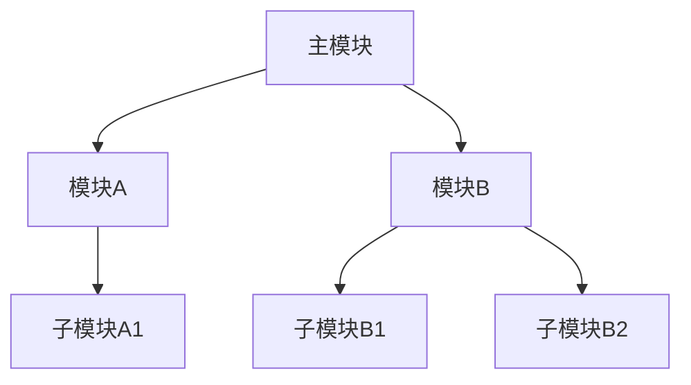

# {项目名称} 代码文档

## 目录

- [项目概述](#项目概述)
- [目录结构](#目录结构)
- [核心模块架构](#核心模块架构)
- [数据流与执行流程](#数据流与执行流程)
- [关键组件详解](#关键组件详解)
- [使用指南](#使用指南)
- [修改与拓展](#修改与拓展)
- [常见问题](#常见问题)

---

## 项目概述

### 项目简介

{简要描述项目是什么、做什么用、解决什么问题}

### 技术栈

| 类别 | 技术/库 | 版本要求 |
|------|--------|----------|
| 语言 | Python | >= 3.8 |
| 主要依赖 | | |
| 可选依赖 | | |

### 功能特性

- 特性1：{描述}
- 特性2：{描述}
- ...

---

## 目录结构

```
{项目根目录}
├── {顶层目录/文件}          # {说明}
│   ├── {子目录/文件}        # {说明}
│   │   ├── {文件}           # {说明}
│   │   └── ...
│   └── ...
├── {目录/文件}              # {说明}
└── ...
```

### 目录/文件说明

| 路径 | 类型 | 说明 |
|------|------|------|
| | | |

---

## 核心模块架构

### 模块依赖关系



### 核心模块列表

| 模块名 | 路径 | 职责 | 依赖 |
|--------|------|------|------|
| | | | |
| | | | |

---

## 数据流与执行流程

### 整体数据流图

```
┌──────────┐     ┌──────────┐     ┌──────────┐     ┌──────────┐
│  输入阶段  │ --> │  处理阶段  │ --> │  转换阶段  │ --> │  输出阶段  │
└──────────┘     └──────────┘     └──────────┘     └──────────┘
```

### 按时间流程的详细执行步骤

> **说明**：以下以 `{具体使用场景/例子}` 为例，说明数据在系统中的流动过程。

#### 阶段 1：{阶段名称}

**时间点**：T = 0ms（初始化阶段）

**触发条件**：{描述何时进入此阶段}

**执行操作**：
1. {操作1}
2. {操作2}
3. ...

**输入**：
| 参数/输入 | 类型 | 来源 | 说明 |
|----------|------|------|------|
| | | | |

**输出**：
| 参数/输出 | 类型 | 去向 | 说明 |
|----------|------|------|------|
| | | | |

**关键代码**：
```python
# 文件路径: {代码文件位置}
# 函数/类: {函数名}

def example_function(input_data):
    """
    {函数简要说明}
    """
    # 步骤1: {操作描述}
    intermediate_result = process_step1(input_data)

    # 步骤2: {操作描述}
    final_result = process_step2(intermediate_result)

    return final_result
```

**处理细节**：
- {细节1}
- {细节2}

---

#### 阶段 2：{阶段名称}

**时间点**：T = {时间}

**触发条件**：{描述何时进入此阶段}

**执行操作**：
1. {操作1}
2. {操作2}
3. ...

**输入**：
| 参数/输入 | 类型 | 来源 | 说明 |
|----------|------|------|------|
| | | | |

**输出**：
| 参数/输出 | 类型 | 去向 | 说明 |
|----------|------|------|------|
| | | | |

**关键代码**：
```python
# 文件路径: {代码文件位置}
# 函数/类: {函数名}

class ExampleClass:
    """
    {类说明}
    """

    def __init__(self, config):
        """
        初始化 - T = {时间}
        """
        self.config = config
        self.state = {}
        # {其他初始化操作}

    def process(self, data):
        """
        处理方法
        """
        # {处理逻辑}
        pass
```

**处理细节**：
- {细节1}
- {细节2}

---

#### 阶段 N：{阶段名称}

**时间点**：T = {时间}

{类似上述格式}

---

### 完整执行示例

以 `{具体例子}` 为例，完整的时间线如下：

| 时间 | 事件 | 涉及模块/函数 | 输入 | 输出 |
|------|------|--------------|------|------|
| T=0 | | | | |
| T=10 | | | | |
| T=50 | | | | |
| ... | | | | |

---

## 关键组件详解

### {组件名称}

**文件路径**：`{路径}`

**职责**：{描述组件的职责}

**初始化流程**（T = 0ms）：

```python
# {代码说明}
```

**主要方法**：

| 方法名 | 功能 | 时间点 | 输入 | 输出 |
|--------|------|--------|------|------|
| | | | | |
| | | | | |

**状态变化**：

| 时间点 | 状态 | 触发条件 | 变化内容 |
|--------|------|----------|----------|
| | | | |
| | | | |

**使用示例**：

```python
from {模块} import {组件}

# 创建实例
instance = {组件}(config={配置})

# 调用方法
result = instance.{方法}({参数})

# 检查结果
print(result)
```

---

### {组件名称}

{类似上述格式}

---

## 使用指南

### 环境配置

```bash
# 1. 创建虚拟环境
python -m venv venv
source venv/bin/activate  # Linux/Mac
# 或
venv\Scripts\activate  # Windows

# 2. 安装依赖
pip install -r requirements.txt

# 3. 配置环境变量
export {VAR_NAME}={值}
# 或创建 .env 文件
```

### 快速开始

```python
import {模块}

# 方式1：简单使用
result = {模块}.{函数}({参数})
print(result)

# 方式2：配置使用
config = {配置}
instance = {模块}.{类}(config)
result = instance.{方法}({参数})
```

### 进阶用法

{详细的使用示例和说明}

---

## 修改与拓展

### 添加新功能

1. **创建新模块**
   - 位置：`{目录}/{新模块}.py`
   - 遵循 `{现有模式}`

2. **注册到主流程**
   - 在 `{配置文件/注册文件}` 中添加
   - 更新依赖关系

3. **添加测试**
   - 位置：`tests/test_{模块}.py`
   - 覆盖率和示例

### 修改现有功能

| 功能 | 文件位置 | 修改方式 |
|------|----------|----------|
| | | |
| | | |

### 拓展数据流

如需在 `{某阶段}` 之前添加新处理步骤：

```python
# 文件: {文件路径}
# 函数: {函数名}

def new_process_step(input_data):
    """
    在 {原步骤} 之前执行的新步骤
    """
    # 处理逻辑
    processed = do_something(input_data)
    return processed

# 集成到主流程
def main_flow():
    # 新步骤
    intermediate = new_process_step(input_data)
    # 原步骤
    result = original_step(intermediate)
    return result
```

---

## 常见问题

### Q1: {问题描述}

**问题**：{详细描述}

**原因**：{解释原因}

**解决方案**：
```python
{解决方案代码}
```

### Q2: {问题描述}

{类似格式}

---

## 附录

### 配置文件说明

| 配置项 | 类型 | 默认值 | 说明 |
|--------|------|--------|------|
| | | | |

### API 参考

详见 [API文档链接]（如有外部文档）

---

*文档生成时间：{时间}*
*适用于版本：{版本}*
